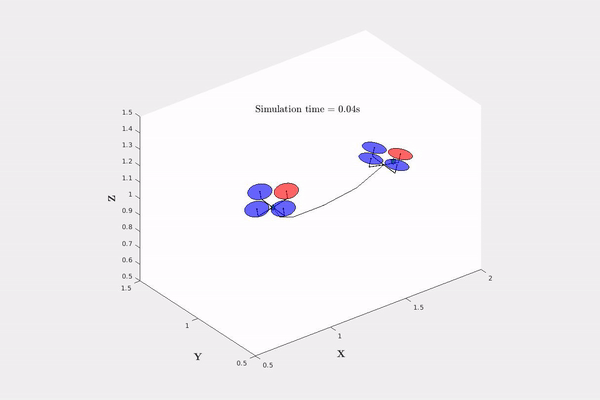
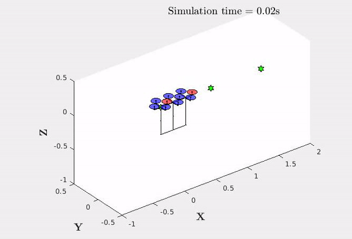
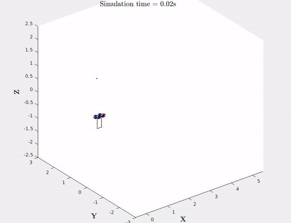

# Multiple Quadrotors Carrying a Flexible Hose: Dynamics, Differential-Flatness and Control


## About

## Running Examples
The Matlab example code has been tested with R2019a version. 


## Simulations
[simulations.mat](https://drive.google.com/open?id=1orp8ZG4U23B6Hyn9AXAL7uglj7Fyrver)
|  Sim 1.1: Setpoint 2 quadrotors  | Sim 1.2: Setpoint 3 quadrotors  | Sim 2: Trajectory 2 quadrotors |
|---|---|---|
|   |   |  |

## Citation

- Kotaru, P., and Sreenath, K., "Multiple quadrotors carrying a flexible hose: dynamics, differential flatness and control." International Federation of Automatic Control World Congress (IFAC), July 2020, to appear.
```
@conference{IFAC2020_Kotaru,
  author={ Prasanth Kotaru and Koushil Sreenath },
  title={ Multiple quadrotors carrying a flexible hose: dynamics, differential flatness and control },
  booktitle={ International Federation of Automatic Control World Congress (IFAC) },  
  month={ July },
  year={ 2020, to appear },
}
```
