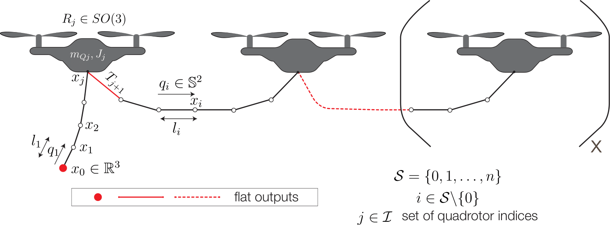

# aerial-flexible-hose
Multiple quadrotors carrying a flexible hose: dynamics, differential flatness and control

<!-- ![differential flatness][logo]

[logo]: ./media/diff-flat.png =250x "Differential Flatness: Mutliple quadrotor flexible hose" 
 -->

<!--  -->
